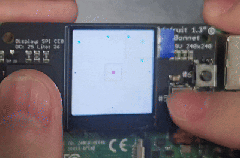

# 라즈베리파이 게임 프로젝트

라즈베리파이에서 ST7789 디스플레이를 사용하는 게임 프로젝트입니다.

## 게임 플레이 영상



## 디렉토리 구조

```
raspi-game-c/
├── driver/                    # 하드웨어 드라이버
│   ├── st7789.c              # ST7789 디스플레이 드라이버 구현
│   └── st7789.h              # ST7789 디스플레이 드라이버 헤더
├── src/                       # 소스 코드
│   ├── common/               # 공통 모듈
│   │   ├── character_struct.h    # 캐릭터 구조체 정의
│   │   ├── game_set.h            # 게임 설정
│   │   ├── global_variable.c      # 전역 변수 구현
│   │   ├── global_variable.h      # 전역 변수 헤더
│   │   ├── input_handler.c        # 입력 처리 구현
│   │   ├── input_handler.h        # 입력 처리 헤더
│   │   ├── skill_set.h            # 스킬 설정
│   │   ├── system_init.c          # 시스템 초기화 구현
│   │   ├── system_init.h          # 시스템 초기화 헤더
│   │   └── utils.h                # 유틸리티 함수
│   ├── logic/                 # 게임 로직
│   │   ├── logic.c            # 게임 로직 구현
│   │   └── logic.h            # 게임 로직 헤더
│   ├── rendering/             # 렌더링 모듈
│   │   ├── randering.c        # 렌더링 구현
│   │   └── randering.h        # 렌더링 헤더
│   └── master.h               # 마스터 헤더 (모든 모듈 통합)
├── main.c                     # 메인 프로그램
├── Makefile                   # 빌드 설정
├── play.gif                   # 게임 플레이 영상 (GIF)
```

## 빌드 방법

```bash
make
```

## 실행 방법

```bash
./main
```

## 정리

```bash
make clean
```

## 재빌드

```bash
make rebuild
```

## 주요 기능

- ST7789 디스플레이 지원
- 버튼 입력 처리
- 게임 로직 및 렌더링
- 스킬 시스템
- 충돌 감지
